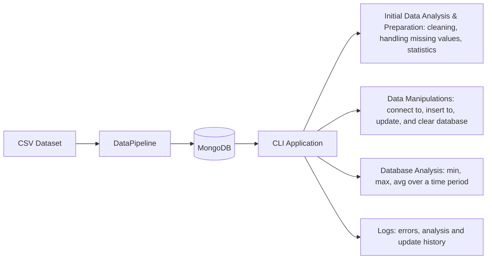
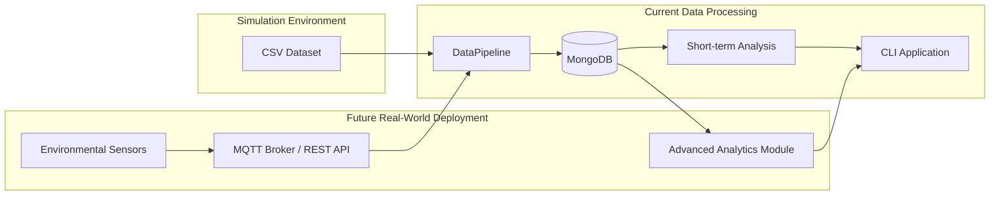

# Mongo database for storing IoT sensor data

## Navigation
- [How to use](#how-to-use)
- [Architecture Overview](#architecture-overview)
- [Simulation Environment](#simulation-environment)
    - [Sumulation story](#sumulation-story)
- [Usage scenario](#usage-scenario)
- [From Simulation to Real Deployment](#from-simulation-to-real-deployment)

## How to use
To run this project, follow the instruction below:
1. Download the repository "code", download [Environmental Sensor Telemetry Data](https://www.kaggle.com/datasets/garystafford/environmental-sensor-data-132k) from kaggle and put it into "data" folder inside "code" directory.  
2. Download Docker Desktop and run it.  
3. Open CLI or IDE (integrated development environment) in the project directory. Then run "_**docker compose up -d --build**_" in the console to create docker images and run containers in the background. To stop containers run "_**docker compose down**_".
4. In order to start the program itself and interact with the database via CLI, run "_**docker exec -it sensor_loader python main.py**_" in the console. You will get the menu where you can choose among different options. In order to run commands connected to the database (between "Clear database" and "Retrieve records"), connect to the database first:  

Regarding functions:  
When you insert the data, the program loads the initial dataset with only four primary columns (ts, device, temp, humidity) into MongoDB. To add the remained columns into database you can both update existing documents (only the first 1,000 rows for testing purposes) and add them as separate documents. To demonstrate that the process works correctly, the program displays five randomly selected records from the updated subset both before and after the update.

## Architecture Overview

This prototype simulates an environmental monitoring system. Historical sensor measurements are imported from CSV files into MongoDB, where they can be queried, analyzed and updated through a command-line interface.

## Simulation Environment
The current implementation operates in a simulated IoT environmental monitoring environment using historical sensor telemetry data.

The original data was generated by three identical custom-built sensor arrays connected to Raspberry Pi devices. Each device was placed in a different physical environment with specific characteristics:
- Device 1: stable conditions with lower temperature and higher humidity.
- Device 2: highly variable temperature and humidity conditions.
- Device 3: stable conditions with higher temperature and lower humidity.

Simulation period:
- 12 July 2020 00:00:00 UTC – 19 July 2020 23:59:59 UTC

Sensors: timestamp, device, temperature, humidity, co, lpg, smoke, motion, light.

The purpose of this simulation is to validate the complete IoT data processing workflow before deployment with real sensor streams. The CSV file replaces live sensor communication and acts as an incoming telemetry source.

The implemented pipeline supports:
- importing sensor measurements into MongoDB;
- checking and cleaning sensor data before storage;
- extending stored records with additional sensor parameters;
- retrieving measurements for selected time intervals;
- calculating basic statistical indicators;
- recording performed analysis and update operations.

Due to the limited one-week dataset, the system focuses on short-term indoor environmental analysis rather than long-term historical trend evaluation.

### Sumulation story
The simulation represents a prototype indoor environmental monitoring system deployed inside a single building. The building contains several monitored indoor areas represented by independent sensor devices. Each device continuously produces environmental telemetry measurements, including temperature, humidity, gas-related indicators, motion, and light intensity. 

In this scenario, the system administrator wants to validate the behaviour of the indoor environmental monitoring system and ensure that sensor data is correctly processed and stored. The administrator can investigate environmental conditions during selected monitoring periods, compare measurements between different sensor devices, and verify that sensor updates and data processing operations are performed correctly.

For example, the administrator can analyze temperature or humidity variations within a selected time interval, review smoke or gas sensor activity, and check the history of performed analysis and update operations.

The administrator can:
- validate incoming sensor data quality;
- store measurements in MongoDB;
- enrich existing records with additional sensor attributes;
- analyze environmental conditions during selected time periods;
- review previous analysis and update operations.

The simulation demonstrates how an IoT telemetry processing workflow can be tested before connecting the system to real sensor infrastructure.

## Usage scenario
**Building Environmental Monitoring System**  
The goal of the system is to collect and store data from environmental sensors installed in different areas of a building. The collected measurements are used to monitor indoor environmental conditions, detect unusual sensor readings, and support short-term analysis. The system receives sensor measurements from multiple sensor devices. Initially, sensors provide basic measurements such as temperature and humidity. Additional sensors extend the monitoring capabilities by measuring carbon monoxide (CO), smoke, LPG, motion, and light levels.  

The current implementation uses one week of historical sensor measurements as a simulation of a real monitoring system. This simulation allows the complete data processing workflow to be validated, including data ingestion, storage, analysis, updating, and logging, before integrating the application with live sensor devices.

**User stories:**  
_Facility manager:_
- As a facility manager, I want sensor measurements to be stored automatically so that I can monitor indoor environmental conditions.
- As a facility manager, I want the system to support new sensor types so that the monitoring system can evolve without changing the database structure.
- As a facility manager, I want to detect missing or inconsistent sensor data so that the stored measurements remain reliable.

Solution:  
**Store sensor measurements automatically**
The `DataPipeline` class provides ingestion of IoT telemetry data. The dataset is loaded, processed, and inserted into MongoDB using batch insertion. The `insert_batch()` method in the `SensorMongoDB` class stores measurements in batches of 1,000 records, which improves performance when handling larger datasets.

**Add new sensor types without changing the database structure**
MongoDB was selected because of its flexible document-based structure. Initially, only the core attributes (`ts`, `device`, `temp`, and `humidity`) are stored. Additional sensor attributes (`co`, `lpg`, `smoke`, `motion`, and `light`) are added later using the `update_batch()` method. This demonstrates that new sensor measurements can be introduced without redesigning the database schema.

**Detect missing or inconsistent sensor data**
The `DataAnalyzer` class is responsible for data quality checks before ingestion. It analyzes the dataset, detects missing values, removes incomplete records or fills missing values depending on the selected strategy, and removes duplicate measurements before storing the data.
<table>
  <tr>
    <td>
      
    </td>
    <td>
      
    </td>
    <td>
      
    </td>
  </tr>
</table>
---

_Maintenance engineer:_
- As a maintenance engineer, I want the data ingestion service to report errors when the database is unavailable so that problems can be resolved.

Solution:  
The `SensorMongoDB` class implements connection monitoring using the `check_connection()` method. Database operations are wrapped with exception handling, and failures are recorded using Python logging. The system creates log entries containing timestamps, severity levels, and error descriptions, allowing maintenance engineers to investigate problems. Additionally, analysis history and update history logs can be observed, which is important for reviewing previously performed operations.
<table>
  <tr>
    <td>
      
    </td>
    <td>
      
    </td>
    <td>
      
    </td>
  </tr>
</table>
---

_Data analyst:_
- As a data analyst, I want to analyse stored sensor measurements over selected time intervals so that I can evaluate indoor environmental conditions.  
- As a data analyst, I want to calculate statistical values such as minimum, maximum, and average sensor readings so that I can understand sensor behaviour during the selected period.

Solution:  
The system provides functionality for retrieving and analysing stored sensor measurements from the database. The DataPipeline allows analysts to select a sensor feature, monitoring date, starting hour, and analysis duration in order to retrieve the corresponding historical records. After filtering the measurements for the selected time interval, the system calculates statistical indicators including minimum, maximum, and average values for the chosen sensor attribute. The analysis results are stored in the analysis history log, allowing previously performed analyses to be reviewed.  
Additionally, analysts can compare measurements between different sensor devices by retrieving records associated with specific device identifiers. This allows evaluation of short-term variations in indoor environmental conditions during the available monitoring period.

Example usage:  
An analyst wants to investigate how the temperature changed during a specific period. Using the CLI interface, the analyst selects the temperature sensor, chooses a starting date and hour, and defines the analysis duration (for example, 6 hours or 3 days). The system retrieves the corresponding measurements from MongoDB and provides statistical results that help identify minimum, maximum and average temperature within the selected period.

<table>
  <tr>
    <td>
      
    </td>
    <td>
      
    </td>
    <td>
      
    </td>
    <td>
      
    </td>
    <td>
      
    </td>
    <td>
      
    </td>
  </tr>
</table>

## From Simulation to Real Deployment

The simulation architecture represents a controlled testing environment where environmental data is provided through a static CSV dataset. This approach allows the system to validate the data processing pipeline, database operations, and analytical functionality without requiring physical hardware. The main purpose of the simulation is to reproduce realistic data flows and verify that the application behaves correctly before deployment.

The future real-world deployment extends the same architecture by replacing the static dataset with live sensor data sources. Environmental sensors collect measurements from physical locations and transmit them through communication protocols such as MQTT or REST API. The DataPipeline remains responsible for receiving and processing incoming telemetry data, while MongoDB continues to provide persistent storage.

However, a real deployment would require additional analytical capabilities beyond the current prototype. Since the current simulation is based on a limited one-week dataset, the implemented analysis focuses on selected short-term periods and basic statistical calculations. A production system with larger sensor networks and longer observation periods would require additional DataPipeline functionality for long-term trend analysis, historical comparisons, anomaly detection, and potentially aggregation of data from multiple buildings or locations.

Therefore, the current implementation provides the foundation for IoT data ingestion and storage, while future extensions would mainly focus on expanding the analytical layer to support large-scale environmental monitoring scenarios.
